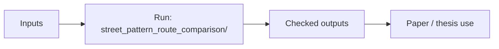
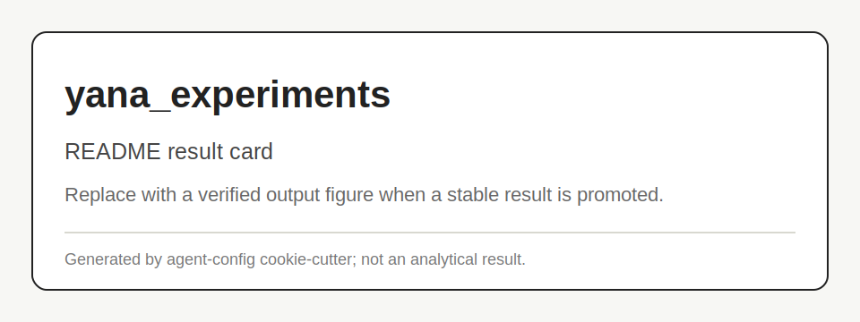

# yana_experiments

Local Yana route-generation experiment workspace.

## Scheme



## Main Result



## Run

Entrypoint: `street_pattern_route_comparison/`

Human:

```bash
Open the relevant experiment folder and run its local README/script when promoted.
```

Agent:

Do not invent fallback route generation to make diversity look better.

## Publication

No standalone publication tracked.

## Next Steps / Heuristics

Heuristic: store duplicate/weak route outputs honestly; promote stable scripts into a named subproject.
