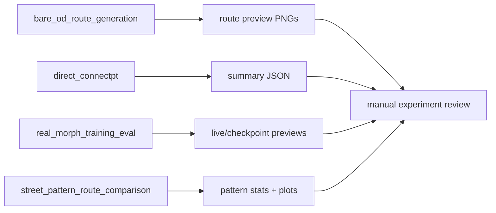
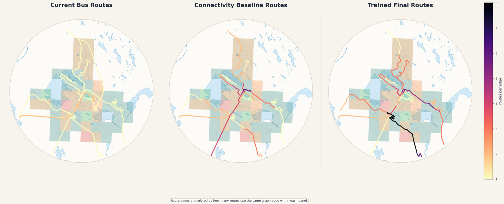

# yana_experiments

Saved route-generation and street-pattern evaluation artifacts. This repo is the experiment ledger: generated routes, OD matrices, summaries, and preview PNGs. The runnable generation code lives upstream in the parent pipeline / ConnectPT stack, not here.

## System Map



## Main Result



## Run

Entrypoint: `real_morph_training_eval/bergen_norway/live_preview/`

Human:

```bash
find real_morph_training_eval street_pattern_route_comparison -name 'summary.json' -o -name '*.png'
```

Agent: treat this as an artifact repo. Inspect `summary.json`, OD matrices, and preview PNGs; do not claim there is runnable local code unless a script is actually added.

## Publication

No standalone publication tracked; experiment repo for dissertation route-generation work.

## Next Steps / Heuristics

Heuristic: live previews are the first sanity check. If route geometry looks wrong, inspect the upstream generator inputs in the parent/ConnectPT workflow before interpreting metrics.
