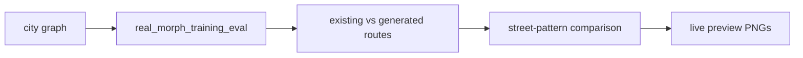

# yana_experiments

Route-generation and street-pattern evaluation experiments, including live previews for real-morphology training runs.

## System Map



## Main Result


## Run

Entrypoint: `street_pattern_route_comparison/`

Human:

```bash
uv run python -m street_pattern_route_comparison --help
```

Agent: compare generated routes against existing routes and street-pattern labels; preserve duplicate/failed route cases as evidence instead of forcing diversity.

## Publication

No standalone publication tracked; experiment repo for dissertation route-generation work.

## Next Steps / Heuristics

Heuristic: the live preview is the first sanity check. If route geometry looks wrong, inspect graph/stops before interpreting metrics.
